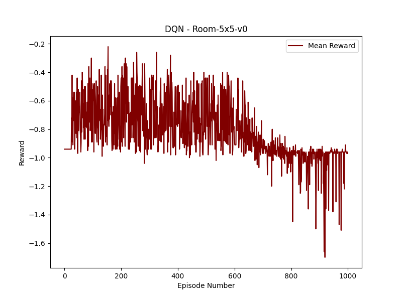
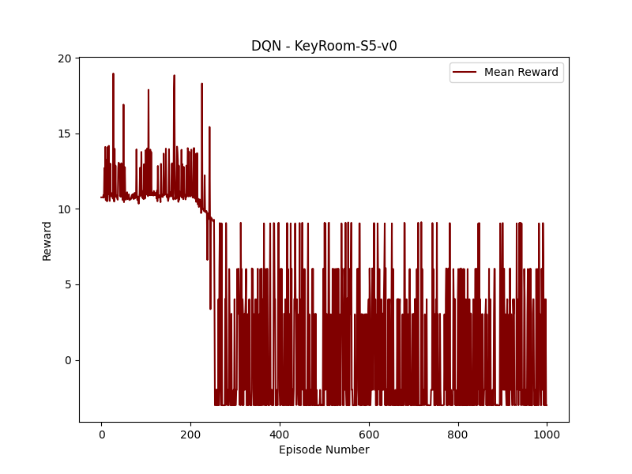
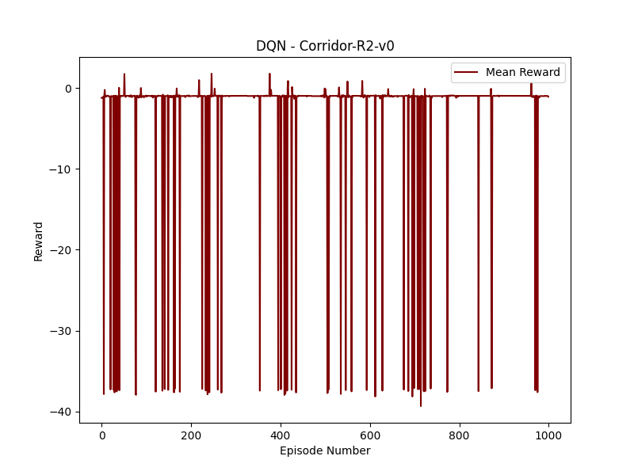
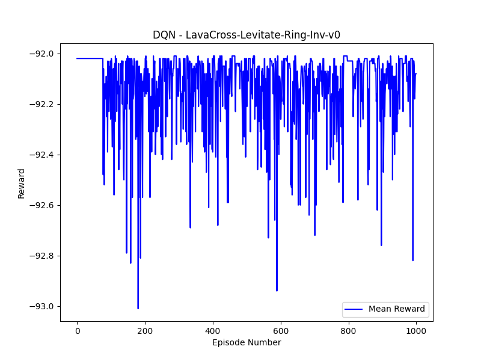
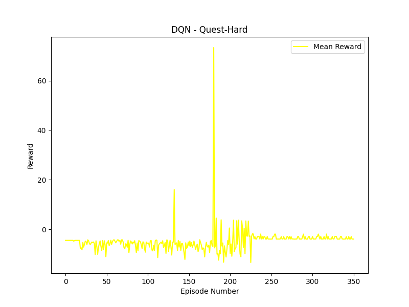

# MiniHack-The-Planet-Deep-RL
## Introduction
A repository containing python implementations of deep reinforcement learning to solve complex problems on the minihack environment. Minihack is qouted to be 'A sandbox framework for easily designing rich and diverse environments for Reinforcement Learning (RL). Based on the game of NetHack'.

 

## Deep Q-Learning Network
All files required in order to run the DQN model are contained in the DQN file. In order to run simply type 'python3 DQN.py' in order to train and recieve results for the DQN model. 
The packages required in order to run include:
 - Pytorch
 - FPDF
 - NLE
 - OS
 - PIL
 - Gym

All relevant architecture information is provided in the 'Reinforcement_learning_writeup.pdf'. The standard architecture of a DQN model can be seen below

 

### Results on different environments
Room 5x5 v0

 

Eat v0

 

Key Room S5 v0

 

Corridor R2 v0

 

Lava Cross Levitate Ring Inv v0

 

Quest Hard v0

 

#### Packages Required
- pytorch https://github.com/pytorch/pytorch
- open ai gym https://github.com/openai/gym
- minihack https://github.com/facebookresearch/minihack

#### Run Instructions
Simply install required packages and run DQN.py file in terminal using the comand 'python3 DQN.py' no arguments are required.

## Reinforce
All files required in order to run the Reinforce model are contained in the Reinforce folder. In order to run, run the cells of the 'test_reinforce.ipynb' notebook.
Major ppackage imports are contained within one of the cells in the notebook.
Googlde colabotory was used to run the notebook, and as such, the working directory, which in my case is '/content/drive/MyDrive/Colab Notebooks/RL_Ass/test_reinforce', will need to be changed to your local working directory in any place where the working directory occurs. (It occurs in 3 places in the notebook).
